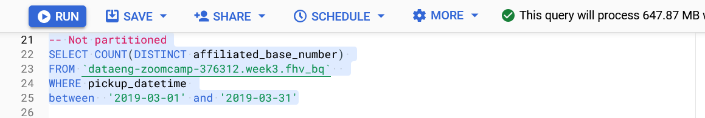
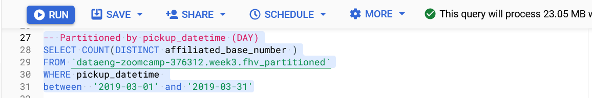

## Week 3 Homework

<b>Uplaoding the data</b></br>
I used a prefect flow to upload the csv.gz files to a GCS bucket. [Link to the ingestion file](./etl_web_to_cgs.py)

<b>SETUP:</b></br>
Create an external table using the fhv 2019 data. </br>
Create a table in BQ using the fhv 2019 data (do not partition or cluster this table). </br>
Data can be found here: https://github.com/DataTalksClub/nyc-tlc-data/releases/tag/fhv </p>

## Question 1:
What is the count for fhv vehicle records for year 2019?
- 65,623,481  
- ✅**43,244,696** 
- 22,978,333
- 13,942,414

<b>CODE:</b></br>
```sql
SELECT COUNT(*) 
FROM `dataeng-zoomcamp-376312.week3.fhv_external` LIMIT 1000;
--RESULT: 43244696

SELECT COUNT(*) 
FROM `dataeng-zoomcamp-376312.week3.fhv_bq` LIMIT 1000;
--Result: 43244696
```

## Question 2:
Write a query to count the distinct number of affiliated_base_number for the entire dataset on both the tables.</br> 
What is the estimated amount of data that will be read when this query is executed on the External Table and the Table?

- 25.2 MB for the External Table and 100.87MB for the BQ Table
- 225.82 MB for the External Table and 47.60MB for the BQ Table
- 0 MB for the External Table and 0MB for the BQ Table
- ✅ **0 MB for the External Table and 317.94MB for the BQ Table** 

<b>CODE:</b></br>
Estimation for the external table:


Estimation for the BigQuery table


> **IMPORTANT NOTE:_**  The estimation for the external table is 0 because BigQuery can't estimate the data processing for external data. This doesn't mean that when the query is executed the data processed will be 0. In fact, for the particular case, the data processed will be 2.52 GB

## Question 3:
How many records have both a blank (null) PUlocationID and DOlocationID in the entire dataset?
- ✅ **717,748** 
- 1,215,687
- 5
- 20,332

<b>CODE:</b></br>
```sql
SELECT COUNT(*)
FROM `dataeng-zoomcamp-376312.week3.fhv_bq` 
WHERE PUlocationID IS NULL  
and DOlocationID IS NULL
--Result: 717748
```

## Question 4:
What is the best strategy to optimize the table if query always filter by pickup_datetime and order by affiliated_base_number?
- Cluster on pickup_datetime Cluster on affiliated_base_number
- ✅**Partition by pickup_datetime Cluster on affiliated_base_number**
- Partition by pickup_datetime Partition by affiliated_base_number
- Partition by affiliated_base_number Cluster on pickup_datetime

## Question 5:
Implement the optimized solution you chose for question 4. Write a query to retrieve the distinct affiliated_base_number between pickup_datetime 2019/03/01 and 2019/03/31 (inclusive).</br> 

```bash
bq load \
--autodetect \
--source_format=CSV \
--clustering_fields=affiliated_base_number \
--time_partitioning_field=pickup_datetime \
--time_partitioning_type=DAY \
week3.fhv_partitioned \
gs://prefect-dataeng-zoomcamp/data/fhv/*
```




Use the BQ table you created earlier in your from clause and note the estimated bytes. Now change the table in the from clause to the partitioned table you created for question 4 and note the estimated bytes processed. What are these values? Choose the answer which most closely matches.
- 12.82 MB for non-partitioned table and 647.87 MB for the partitioned table
- ✅**647.87 MB for non-partitioned table and 23.06 MB for the partitioned table**
- 582.63 MB for non-partitioned table and 0 MB for the partitioned table
- 646.25 MB for non-partitioned table and 646.25 MB for the partitioned table

**Reference Documentation:**  
https://cloud.google.com/bigquery/docs/partitioned-tables
https://cloud.google.com/bigquery/docs/reference/bq-cli-reference#bq_load
https://cloud.google.com/bigquery/docs/schema-detect#bq


## Question 6: 
Where is the data stored in the External Table you created?

- Big Query
- ✅**GCP Bucket**
- Container Registry
- Big Table


## Question 7:
It is best practice in Big Query to always cluster your data:
- True
- ✅**False**


## (Not required) Question 8:
A better format to store these files may be parquet. Create a data pipeline to download the gzip files and convert them into parquet. Upload the files to your GCP Bucket and create an External and BQ Table. 

Note: Column types for all files used in an External Table must have the same datatype. While an External Table may be created and shown in the side panel in Big Query, this will need to be validated by running a count query on the External Table to check if any errors occur. 
 


```sql
-- The first step is loading the parquet files into GCS  -- with a consistent data type for each column.   
-- After that we can create the external table with  
-- the following command:
LOAD DATA OVERWRITE week3.fhv_parquet
FROM FILES (
  format = 'PARQUET',
  uris = ['gs://prefect-dataeng-zoomcamp/data/*.parquet']);

```
